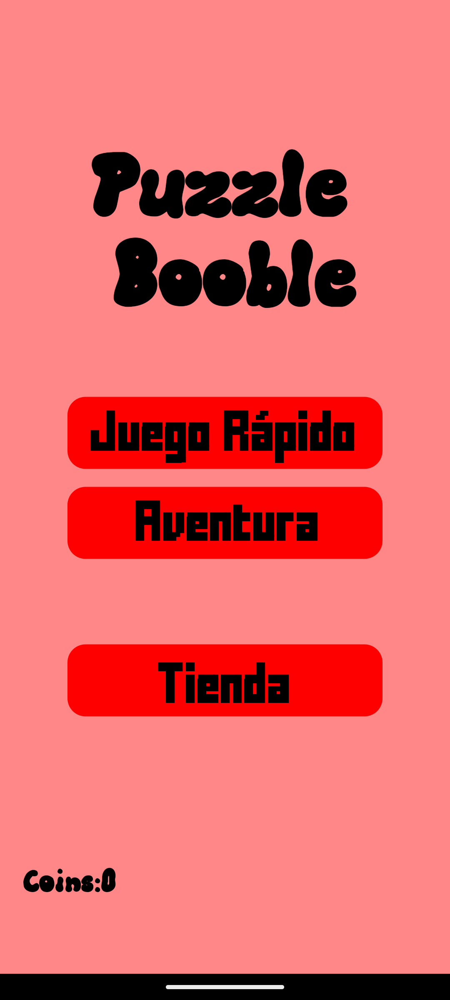
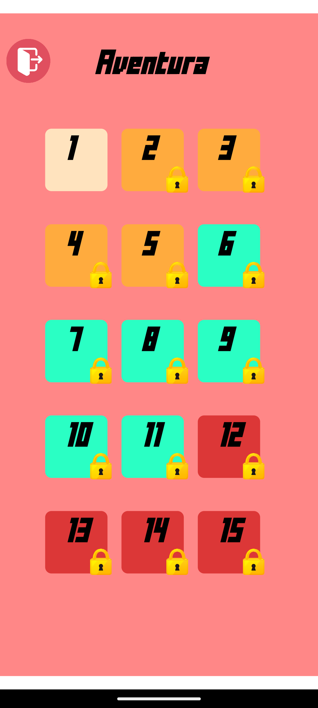
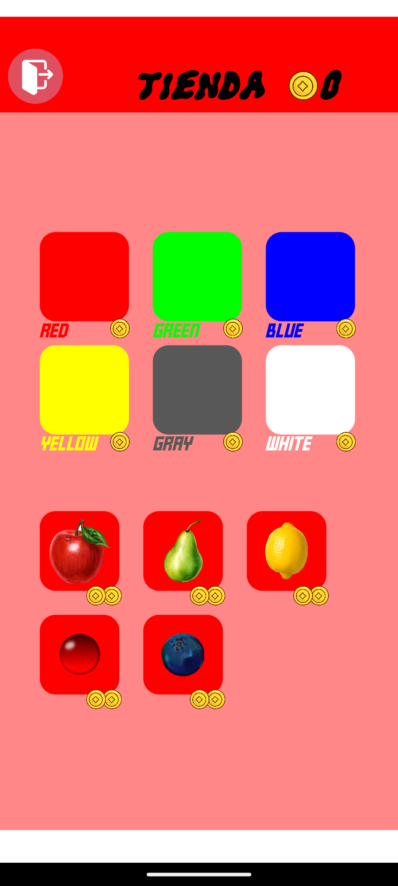
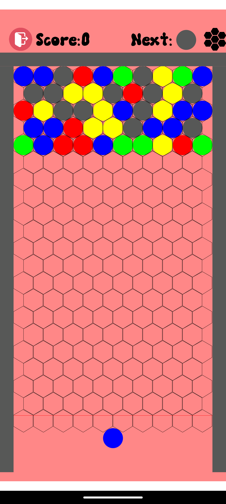
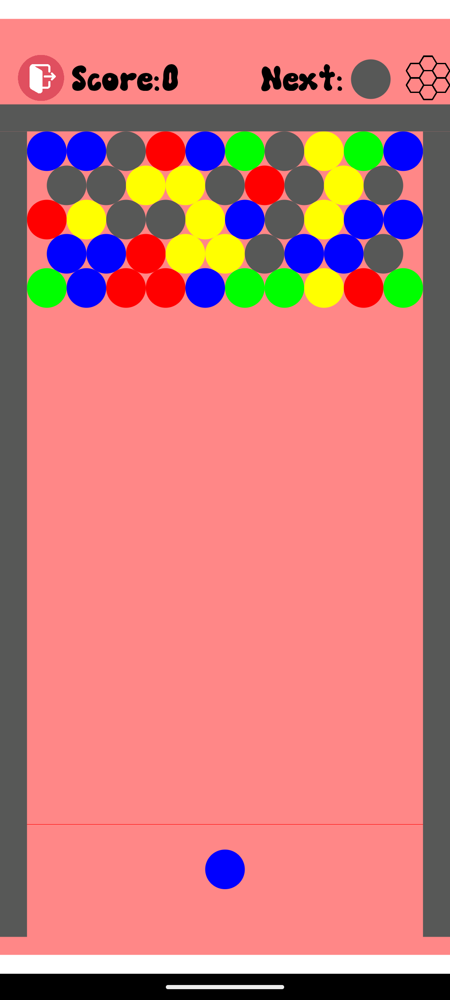

# 🎯 Bubble Adventure – Juego en Android Studio

**Bubble Adventure** es un juego arcade desarrollado en Android Studio con Java. El jugador dispara burbujas de colores en una cuadrícula con el objetivo de hacer coincidir tres o más del mismo color para eliminarlas. Combina reflejos y estrategia para superar todos los niveles.

## 🎩 Características principales

* 🎮 Jugabilidad tipo Puzzle Bobble.
* 🎯 Disparo de burbujas controlado por el jugador.
* 🧠 Eliminación por combinación de colores.
* 💥 Efectos de explosión de burbujas.
* 💼 Tienda para mejoras y progresión.
* 🏆 Escena de victoria y pantalla de Game Over.
* 🔄 Sistema de gestión de escenas con transición.

## 📸 Capturas

<p align="center">
  
  
  
</p>
<p align="center">
  
  
</p>

## 🧠 Tecnologías utilizadas

* Android Studio con Java
* Canvas API para dibujo y animación
* Sistema de escenas personalizado
* Lógica de colisiones básica

## 📂 Estructura del proyecto

* `Aventura.java`: Clase principal del juego.
* `IntroScene.java`: Pantalla de introducción y menú inicial.
* `Shop.java`: Escena de tienda para mejoras.
* `SceneManager.java`: Controlador de escenas (Intro, Juego, Tienda, Victoria, Game Over).
* `Grid.java`: Controla la cuadrícula de burbujas.
* `Bubble.java`: Modelo de burbuja (posición, color, estado).
* `PlayerBubble.java`: Burbuja que el jugador lanza.
* `ColorEnum.java`: Enum para colores disponibles.
* `VictoryScene.java`: Escena mostrada al ganar.
* `GameOverScene.java`: Escena mostrada al perder.

## 🚀 Cómo compilar

1. Clona este repositorio:

   ```bash
   git clone https://github.com/Dorjeekhb/BubbleAdventure.git
   ```
2. Abre el proyecto en Android Studio.
3. Conéctate a un emulador o dispositivo físico.
4. Ejecuta el proyecto con ▶️.

## 📱 Requisitos mínimos

* Android 6.0 (API 23) o superior.
* Java 8.
* Dispositivo con pantalla táctil.

---

# 🎯 Bubble Adventure – Android Studio Game

**Bubble Adventure** is an arcade game developed in Android Studio using Java. The player shoots colored bubbles into a grid, aiming to match three or more of the same color to clear them. It combines reflexes and strategy to beat each level.

## 🎩 Main Features

* 🎮 Puzzle Bobble-style gameplay.
* 🎯 Player-controlled bubble shooting.
* 🧠 Match-3 color elimination logic.
* 💥 Bubble popping effects.
* 💼 In-game shop for upgrades.
* 🏆 Victory and Game Over scenes.
* 🔄 Custom scene manager with transitions.

## 📸 Screenshots

<p align="center">
  
  
  
</p>
<p align="center">
  
  
</p>

## 🧠 Tech Stack

* Android Studio with Java
* Canvas API for 2D drawing and animation
* Custom scene system
* Basic collision logic

## 📂 Project Structure

* `Aventura.java`: Main game class.
* `IntroScene.java`: Intro/menu screen.
* `Shop.java`: Upgrade shop screen.
* `SceneManager.java`: Scene controller (Intro, Game, Shop, Victory, Game Over).
* `Grid.java`: Manages bubble grid.
* `Bubble.java`: Bubble object (position, color, state).
* `PlayerBubble.java`: Bubble launched by player.
* `ColorEnum.java`: Enum for color types.
* `VictoryScene.java`: Shown when winning.
* `GameOverScene.java`: Shown when losing.

## 🚀 How to Compile

1. Clone this repo:

   ```bash
   git clone https://github.com/Dorjeekhb/BubbleAdventure.git
   ```
2. Open the project in Android Studio.
3. Connect an emulator or Android device.
4. Press ▶️ to build and run.

## 📱 Minimum Requirements

* Android 6.0 (API 23) or higher
* Java 8
* Touchscreen device

---

© 2025 Dorjee – Bubble arcade game project for Android
